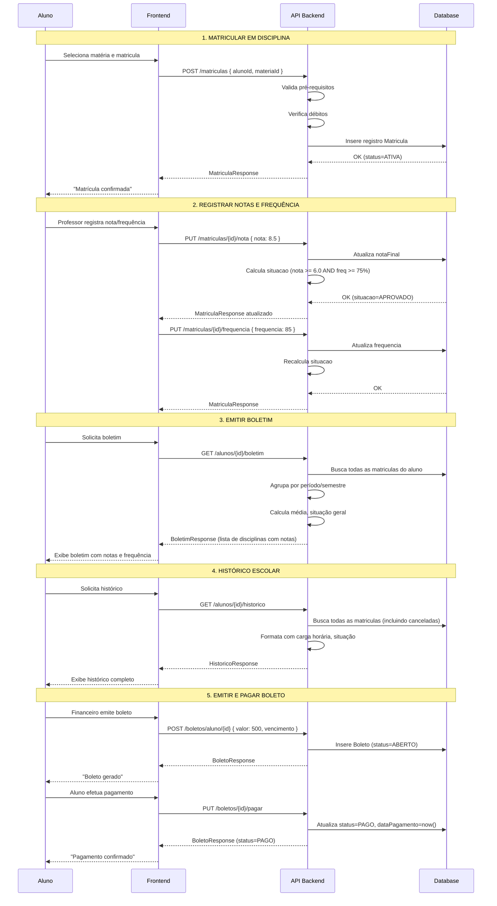
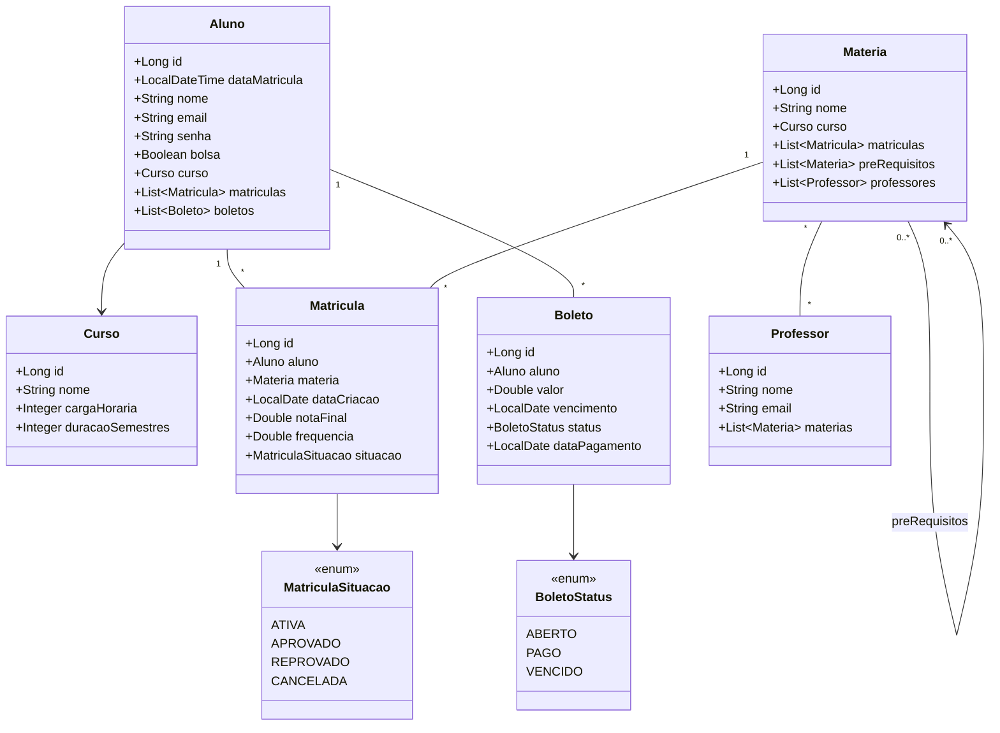

# Diagramas de Implementação — Minerva

Documentação visual do que falta implementar no projeto.

---

## 1. Diagrama de Sequência — Fluxo Completo



---

## 2. Diagrama de Classes — Arquitetura



---

## 3. Tabela de Endpoints

| Recurso | Método | Endpoint | Descrição |
|---------|--------|----------|-----------|
| **Matrícula** | POST | `/matriculas` | Matricular aluno em disciplina |
| | GET | `/matriculas/aluno/{alunoId}` | Listar matrículas ativas de um aluno |
| | GET | `/matriculas/materia/{materiaId}` | Listar alunos matriculados em uma matéria |
| | PUT | `/matriculas/{id}/nota` | Registrar nota final |
| | PUT | `/matriculas/{id}/frequencia` | Registrar frequência |
| **Boletim** | GET | `/alunos/{id}/boletim` | Gerar boletim (notas atuais) |
| **Histórico** | GET | `/alunos/{id}/historico` | Histórico escolar completo |
| **Boleto** | POST | `/boletos/aluno/{alunoId}` | Emitir boleto para aluno |
| | GET | `/boletos/aluno/{alunoId}` | Listar boletos de um aluno |
| | PUT | `/boletos/{id}/pagar` | Registrar pagamento de boleto |
| **Matéria** | POST | `/materias/{id}/prerequisitos` | Adicionar pré-requisito a matéria |

---

## 4. Regras de Negócio

### Matrícula
- ✅ Aluno deve existir
- ✅ Matéria deve existir
- ✅ Aluno não pode estar matriculado já na mesma matéria
- ✅ Aluno não pode ter débitos em aberto (ABERTO ou VENCIDO)
- ✅ Aluno deve ter cumprido todos os pré-requisitos da matéria

### Aprovação
- Nota final >= 6.0 **E** Frequência >= 75% → **APROVADO**
- Nota final < 6.0 **OU** Frequência < 75% → **REPROVADO**
- Enquanto nota e frequência não forem preenchidas → **ATIVA**

### Boletim
- Agregação de todas as matriculas ativas e aprovadas/reprovadas
- Cálculo de média geral
- Carga horária total cumprida

### Histórico
- Todas as matriculas (inclusive canceladas)
- Informações de aprovação/reprovação
- Carga horária total e distribuição por período

### Boleto
- Emissão manual ou automática por período letivo
- Status: ABERTO → PAGO ou VENCIDO
- Bloqueio de matrícula se houver débito aberto/vencido

---

## 5. Divisão de Tarefas Recomendada

### Task 1: Matrícula e Pré-requisitos
- Criar `MatriculaService` com lógica de validação
- Criar `MatriculaController` com endpoints de matrícula
- Implementar `MatriculaRepository` com queries customizadas
- Criar DTOs: `MatriculaRequest`, `MatriculaResponse`
- Atualizar modelo `Materia` com relação de pré-requisitos

### Task 2: Notas e Frequência
- Adicionar campos `notaFinal` e `frequencia` em `Matricula`
- Implementar endpoints PUT `/matriculas/{id}/nota` e `/frequencia`
- Criar lógica de cálculo de aprovação em `MatriculaService`
- Criar enums: `MatriculaSituacao`

### Task 3: Boletim e Histórico
- Criar endpoints GET `/alunos/{id}/boletim` e `/historico`
- Criar DTOs: `BoletimResponse`, `HistoricoResponse`
- Implementar agregação de dados em `MatriculaService`
- Cálculo de média e carga horária total

### Task 4: Boletos e Pagamentos
- Criar modelo `Boleto` com `BoletoStatus`
- Criar `BoletoService` e `BoletoController`
- Criar `BoletoRepository`
- Criar DTOs: `BoletoRequest`, `BoletoResponse`
- Integrar validação de débito em matrícula

### Task 5: Frontend
- Página de **Matrícula em Disciplinas**
- Página de **Visualizar Boletim**
- Página de **Histórico Escolar**
- Página de **Gerenciar Boletos** (listar, emitir, pagar)
- Atualizar página de **Alunos** com links para novas seções

---

## 6. Como Visualizar os Diagramas

### Opção 1: VS Code com extensão Mermaid
Instale a extensão `Markdown Preview Mermaid Support` no VS Code para visualizar os diagramas neste arquivo.

### Opção 2: Mermaid Live Editor
Copie o código Mermaid e cole em: https://mermaid.live/

### Opção 3: Exportar como imagem
Use a ferramenta Mermaid CLI:
```bash
npm install -g @mermaid-js/mermaid-cli
mmdc -i DIAGRAMAS_IMPLEMENTACAO.md -o diagramas.png
```

---

**Data de criação:** 05/06/2026  
**Status:** Pronto para divisão entre colaboradores
